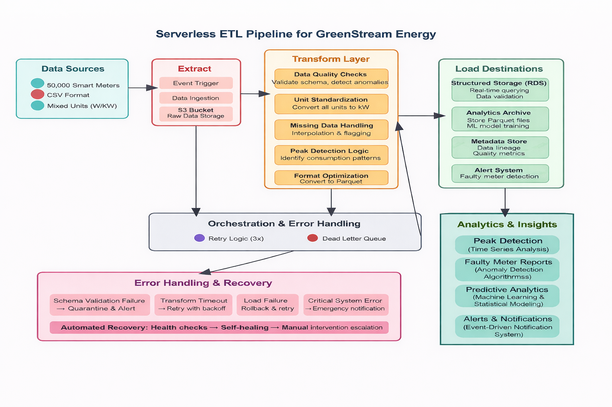

# Smart Meter Serverless ETL Pipeline

## Overview
This project implements a serverless ETL pipeline for smart meter data. It ingests raw energy consumption records, validates and cleans the data, stores it in optimized formats, and prepares it for analytics and predictive modeling. The pipeline ensures reliability, fault tolerance, and traceability across all stages.

---

## Pipeline Workflow

### 1. Raw Data Ingestion
- Smart meter CSV files are uploaded to the raw storage layer.  
- Data is stored exactly as received to preserve traceability.

### 2. Triggering Transformation
- Arrival of a new file triggers the orchestration layer automatically.  
- The orchestration manages dependencies, execution flow, and retries in case of failures.

### 3. Data Cleaning & Validation
- Energy units are standardized to kW.  
- Missing values are interpolated for short gaps or flagged for long gaps.  
- Abnormal readings and potentially faulty meters are detected.  
- Invalid or suspicious records are quarantined or logged.

### 4. Structured Storage (RDS)
- Cleaned and validated data is stored in relational storage for:  
  - Fast querying  
  - Operational reporting  
  - Data validation  
- This represents the single source of truth for clean operational data.

### 5. Conversion & Archival (Parquet)
- Validated records are converted to columnar Parquet format.  
- Data is partitioned by date and meter ID for optimized querying.  
- Archived for long-term analysis, machine learning, and forecasting.

### 6. Analytics & Insights
- Analytics layer consumes Parquet data to:  
  - Detect peak energy consumption periods  
  - Analyze usage patterns  
  - Identify anomalies  
  - Support predictive analytics and forecasting

### 7. Error Handling & Reliability
- Automatic retries (up to 3 attempts) for transient failures.  
- Persistent failures sent to a dead-letter queue (DLQ).  
- Critical issues trigger alerts for manual investigation.

---

## Data Rules

### Unit Standardization
- Convert energy from W to kW if necessary.  
- Keep kW values unchanged.  
- Flag and log invalid units.

### Missing Data Handling
- Short missing intervals are interpolated.  
- Long missing intervals are excluded from analytics.  
- All interpolated values are labeled as estimated in the metadata.

### Data Validation
- Negative values are invalid and quarantined.  
- Unrealistic readings are flagged as outliers.  
- Duplicate, missing, or out-of-range timestamps are rejected.  
- All validation failures are logged for audit purposes.

### Faulty Meter Detection
- Continuous zero readings over long periods are flagged.  
- Constant values over extended intervals are marked suspicious.  
- Extreme deviations from historical patterns are classified as anomalies.  
- Flagged meters are excluded from peak usage calculations and sent to the alert system.

### Data Format Optimization
- Convert validated data to Parquet format.  
- Partition data by time (date) and meter ID.  
- Automatic retry on conversion failure; unresolved issues sent to DLQ.

---

## Outcome
The ETL pipeline ensures reliable ingestion, cleaning, validation, and storage of smart meter data. It prepares data for analytics and predictive modeling while maintaining traceability, fault tolerance, and operational reliability.
